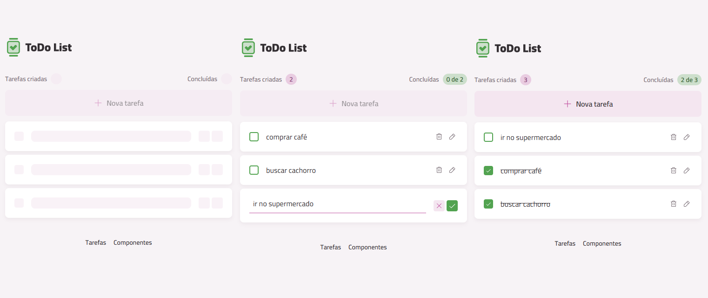

# Formação React 2025 - Rocketseat

## 📋 Descrição
Este repositório contém todos os materiais e projetos desenvolvidos na [Formação React 2025](https://app.rocketseat.com.br/journey/react-2025/) da Rocketseat.

## ‼️ Índice

## 💻 Materiais e Projetos

### Fundamentos
- Fundamentos do React
  - Componentes
  - Propriedades
- Interatividade
  - Eventos
  - Renderização de listas e condicionais
  - React Hooks (Estados, Context API, Efeitos)
  - Custom Hooks

#### Projetos

### Criando primeiro projeto com tooling
- Criação de um projeto React utilizando [Vitejs](https://vite.dev/)
- Configuração e uso do [TailwindCSS](https://tailwindcss.com/)
- Configuração e uso do [vite-plugin-svgr](https://www.npmjs.com/package/vite-plugin-svgr) para transformar SVG em componentes React
- Configuração e uso do  para faciliar a criação de variantes dos componentes
- Criação de todos os componentes de uso do projeto
- Criação da interface
- Uso da biblioteca 'use-local-storage' para facilitar salvar e consumir do localStorage
- Aplicação das regras de negócio (Buscar, Inserir, Deletar, Editar)

#### Projetos
